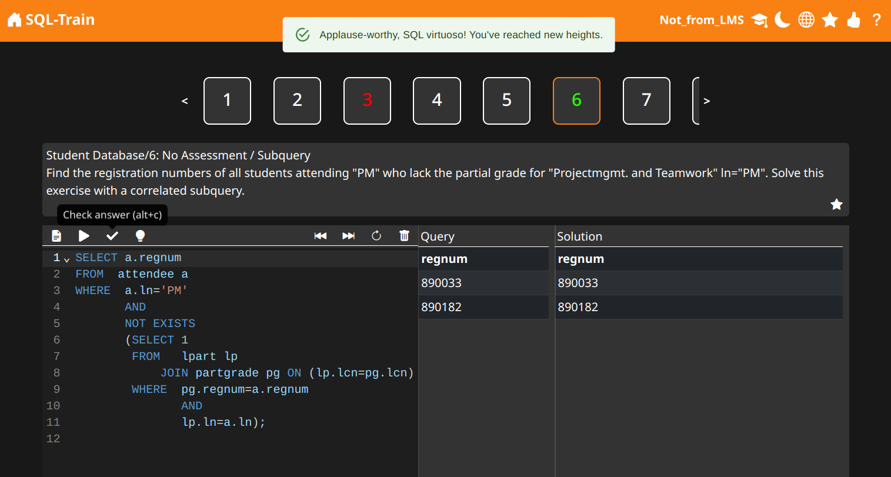

<!--
SPDX-FileCopyrightText: 2023 2023, Nicolas Bota, Marcel Geiger, Florian Paul, Rajbir Singh, Niklas Sirch, Jan Swiridow, Duc Minh Vu, Mike Wegele

SPDX-License-Identifier: CC-BY-SA-4.0
-->

<div id="top"></div>

<!-- PROJECT LOGO -->
<br />
<h1 align="center">
    <a href="#">
         </br>
        <b>SQL-Train</b>
    </a>
</h1>

<h4 align="center">SQL Training LTI Tool</h4>

<!-- Add link to documentation-->
<div align="center">
    
    
    
</div>

SQL-Train is a learning platform created by students for students, where you can
execute and solve SQL tasks directly in your browser. The Tool can be integrated
in to LMSs via LTI (Learning Tools Interoperability).

This project was part of the summer term projects 2023 of the
[Augsburg Technological University of Applied Sciences](https://th-augsburg.de)[^1]
and was supervised by Prof. Dr. Matthias Kolonko.

<div align="center">
     </br>
</div>

## Get Started

### Version Compatibility

| Python | Node | Libpq |
| ------ | ---- | ----- |
| >=3.9  | >=16 | >=15  |

### Setup

```bash
npm install --prefix frontend/
npm run build --prefix frontend/
python -m pip install -r requirements.txt
```

### Environment Variables

Create an `.env` file and set all the variable from `.env-testing`.

### Create Database Schema

```bash
python manage.py makemigrations
python manage.py migrate
```

### Load Example Data

In order to populate the website with exercises, some example data has been
provided that can be loaded into the database.

_Unfortunately we cannot release the exercises because we don't have the
right.You have to provide your own._

```bash
python manage.py loaddata exercises_data/*.yaml
```

### Create Admin Account

To use the website locally, you need to create a superuser (admin) account that
will allow you to manage the database.

```bash
python manage.py createsuperuser
```

### Start Application

```bash
python manage.py runserver
```

After launching the frontend for the first time, you need to log in to
[http://127.0.0.1:8000/admin](http://127.0.0.1:8000/admin) using the superuser
account you just created in order to establish a connection to the website. Then
you can use the app at the [http://127.0.0.1:8000/](http://127.0.0.1:8000/).

**See Deployment View in docs to set up for production.**

## Features

- Authentication via LTI
- Support for all full DML and DDL
- I18n
- User-friendly, clean and modern UI

## Contributing

The project was a cross-semester project at the Augsburg Technological
University of Applied Sciences. The members of the project were the following
members

**Nicolas Bota** <br> **Marcel Geiger** <br> **Florian Paul** <br> **Rajbir
Singh** <br> **Niklas Sirch** <br> **Jan Swiridow** <br> **Duc Minh Vu** <br>
**Mike Wegele**

Thank you for considering contributing to our project! We welcome any
suggestions, bug reports, or feature requests. Please feel free to submit a pull
request or open an issue on our Github repository.

## Contributing Guidelines

Before submitting a pull request, please make sure to

- Follow the existing coding style and naming conventions
- Write clear and concise commit messages
- Provide test coverage for any new features or changes

## Thanks

We would like to express our thanks to Sabine Müllenbach from TH Augsburg for
providing the concept of our tool in the project repDB, which has provided
students with an valuable learning tool.

We are also grateful to the creators of Hyperchalk for their open source code
contribution in developing the LTI Advantage 1.3 automatic registration. Thank
you very much.

## Licenses

This work is licensed under multiple licences. Because keeping this section
up-to-date is challenging, here is a brief summary as of June 2023:

- All original source code is licensed under GPL-3.0-or-later.
- The Logo contains the iconic face group of the logo of the TH Augsburg[^1] and
  is licensed under CC-BY-ND-4.0
- All documentation and images are licensed under CC-BY-SA-4.0.
- All insignificant file such as configs are licensed under CC0-1.0.
- The code borrowed from [Hyperchalk](https://github.com/Hyperchalk/Hyperchalk/)
  is licensed under GPL-3.0 For more accurate information, check the individual
  files.
- The documentation is based on arc42 template, originally created by Gernot
  Starke and Peter Hruschka, which can be found
  [here](https://arc42.org/download) and has been altered to fit our needs.
  arc42 is licensed under CC-BY-SA-4.0.

[^1]:
    Imprint of the TH Augsburg:
    [Imprint](https://www.hs-augsburg.de/en/service/Impressum.html)
