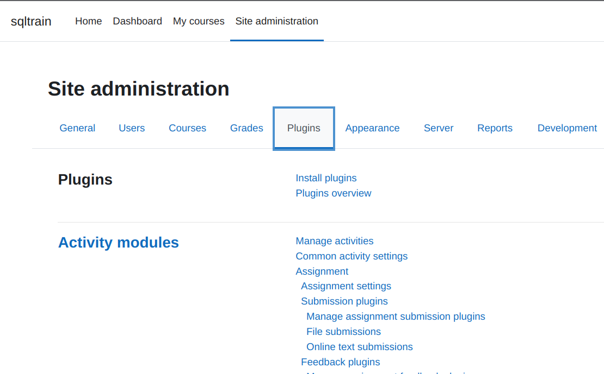
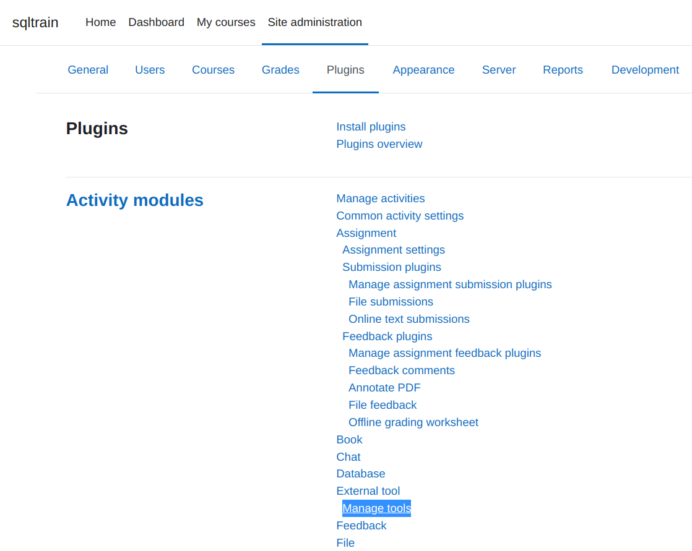
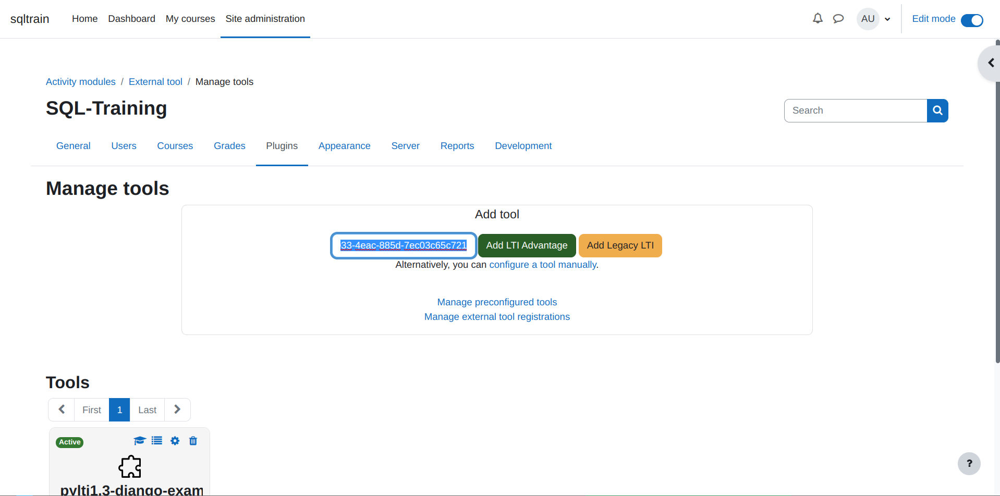
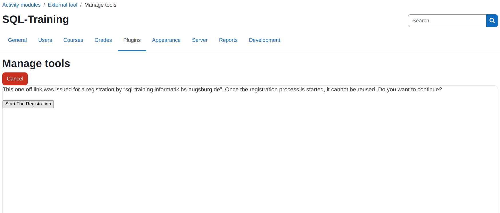
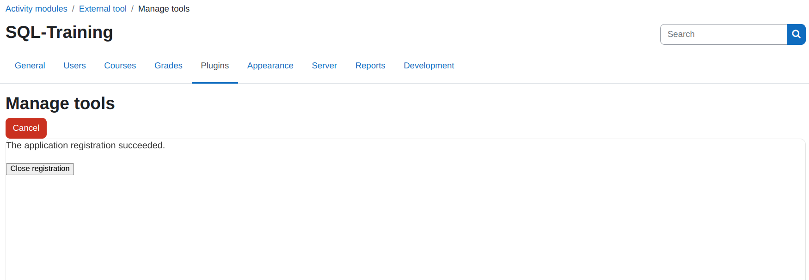
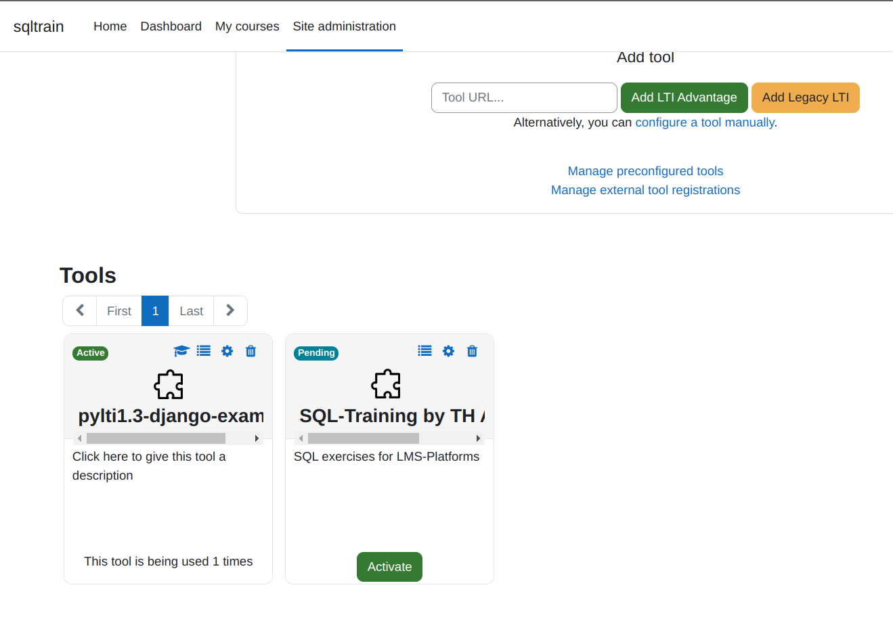
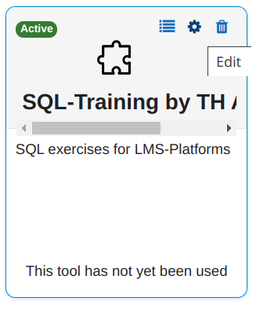
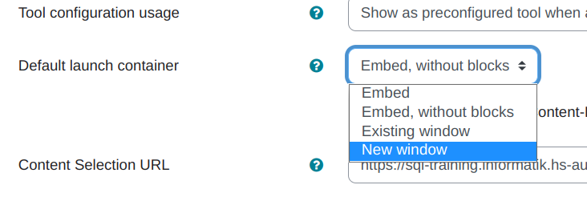

<!--
SPDX-FileCopyrightText: 2023 2023, Nicolas Bota, Marcel Geiger, Florian Paul, Rajbir Singh, Niklas Sirch, Jan Swiridow, Duc Minh Vu, Mike Wegele

SPDX-License-Identifier: CC-BY-SA-4.0
-->

# Register Tool

## Instructions for registering SQL-Train in Moodle:

1. First, you need to navigate to the 'Manage Tools' page. To do this, follow the path through 'Site administration' to 'Plugins', and then select 'Manage Tools' from the list.

2. On the page, you have the option to enter a Tool URL. Simply paste the provided link there and click on 'Add LTI Advantage'.

3. You will then be redirected to this page. There, you need to click on 'Start The Registration' to initiate the exchange of important registration data between Moodle and our tool. After that, you can click on 'Close Registration'.

4. After that, don't forget to activate the tool.

5. Finally, you need to change the default launch container of our tool. To do this, click on 'Edit' and select 'New window' or 'Existing window' in the following form.

