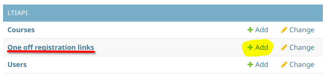
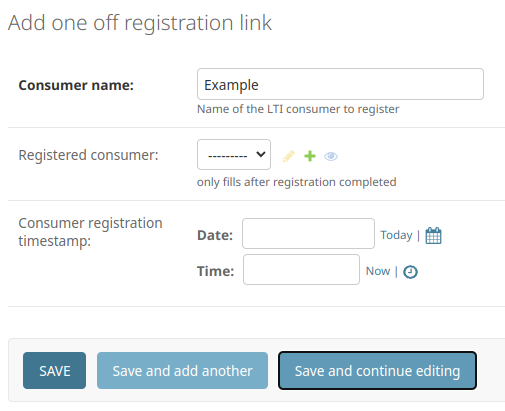
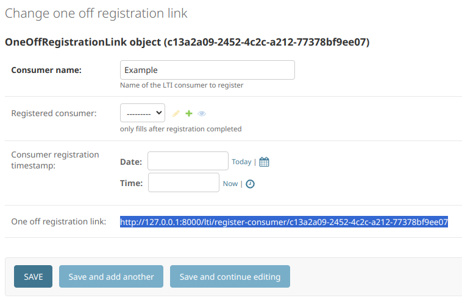

<!--
SPDX-FileCopyrightText: 2023 2023, Nicolas Bota, Marcel Geiger, Florian Paul, Rajbir Singh, Niklas Sirch, Jan Swiridow, Duc Minh Vu, Mike Wegele

SPDX-License-Identifier: CC-BY-SA-4.0
-->

# Register Tool for SQL-Train Admin

## Command Line Instructions

Interactively generate a consumer link which you can give your LMS admin with:

```bash
python manage.py makeconsumerlink
```

## Django Admin Page

Go the admin page, locate "One off registration links" and add an object.



Fill in the name of the consumer and save.



Give the link to your LMS admin.



## Notes

The host of the URL is set by `LINK_BASE`.