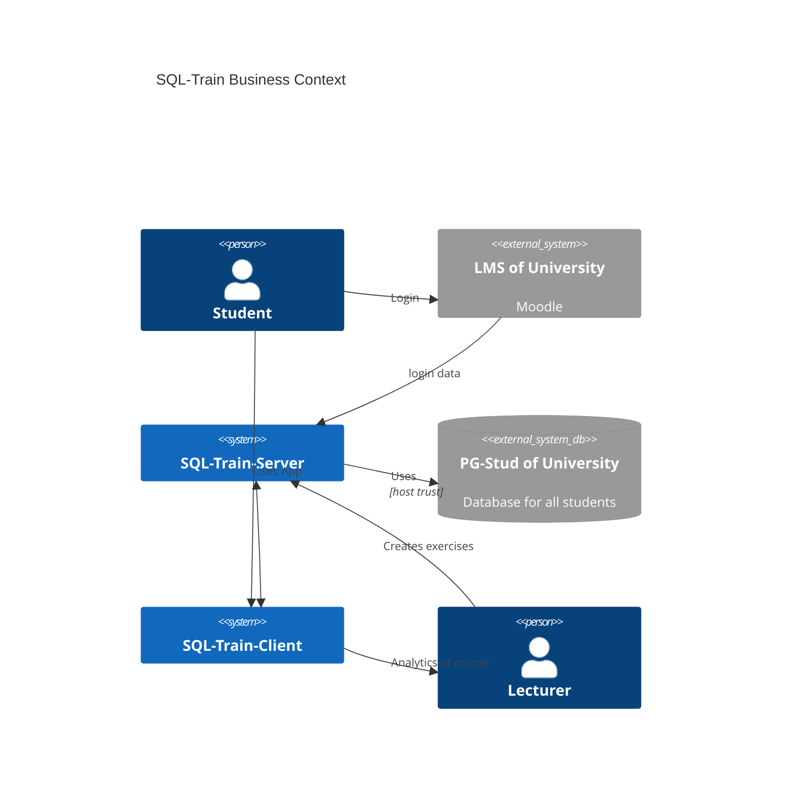

<!--
SPDX-FileCopyrightText: 2023 2023, Nicolas Bota, Marcel Geiger, Florian Paul, Rajbir Singh, Niklas Sirch, Jan Swiridow, Duc Minh Vu, Mike Wegele

SPDX-License-Identifier: CC-BY-SA-4.0

This file is based on arc42 template, originally created by Gernot Starke and Peter Hruschka, which can be found [here](https://arc42.org/download) and has been altered to fit our needs. arc42 is licensed under CC-BY-SA-4.0.
-->

# System and Context

## Business Context

### Student (user)

Students use tool (run queries and check their answers).

### Lecturer (admin)

The Lecturer can add exercises to SQL-Train and get an overview of the students
usage of the tool.

### LMS (Moodle)

The LMS has to transmit the pg-stud username of the student.

### PG-Stud

SQL-Train enables the student to directly execute statements on the training
server pg-stud, made specifically for the students.

## Technical Context

We have already provided a detailed description of the technical context in the
deployment view and have further elaborated on it in the runtime view.
Therefore, we will not reiterate that information here.

For security information see the separate section.
