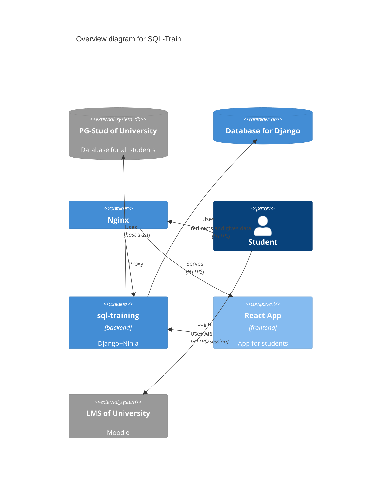

<!--
SPDX-FileCopyrightText: 2023 2023, Nicolas Bota, Marcel Geiger, Florian Paul, Rajbir Singh, Niklas Sirch, Jan Swiridow, Duc Minh Vu, Mike Wegele

SPDX-License-Identifier: CC-BY-SA-4.0

This file is based on arc42 template, originally created by Gernot Starke and Peter Hruschka, which can be found [here](https://arc42.org/download) and has been altered to fit our needs. arc42 is licensed under CC-BY-SA-4.0. 
-->

# Building Block View

## Whitebox Overall System

### Motivation  

SQL-Train provides the student with SQL exercises. They can work on those on
their own database located in the university. The authorization is done via
LTI with the LMS of the university.

Contained Building Blocks  
* Frontend React Single Page Application
* Backend Django project with Ninja API

The remaining containers are explained in the [Deployment View](07_deployment_view.md).
