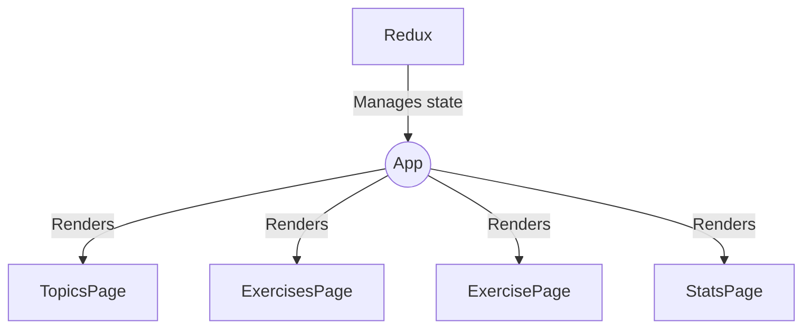
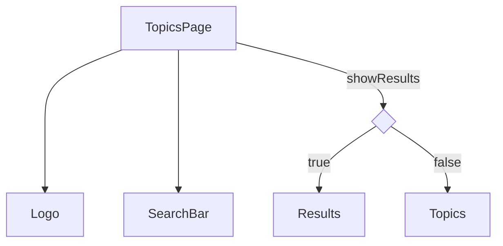
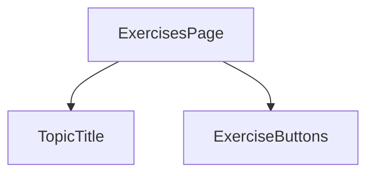
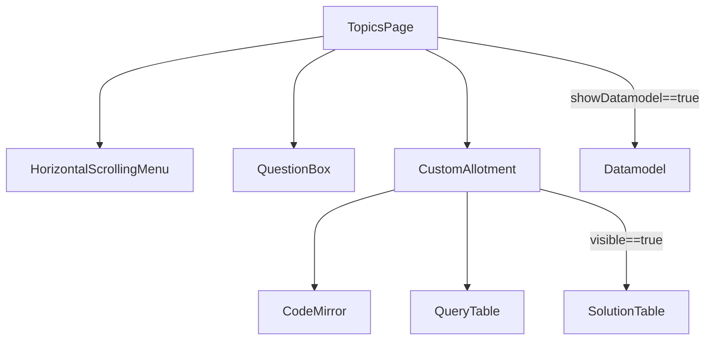
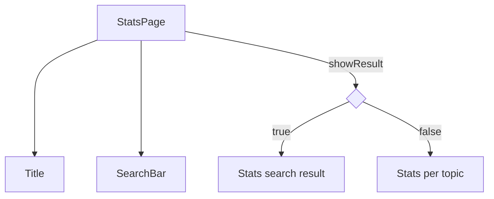

<!--
SPDX-FileCopyrightText: 2023 2023, Nicolas Bota, Marcel Geiger, Florian Paul, Rajbir Singh, Niklas Sirch, Jan Swiridow, Duc Minh Vu, Mike Wegele

SPDX-License-Identifier: CC-BY-SA-4.0

This file is based on arc42 template, originally created by Gernot Starke and Peter Hruschka, which can be found [here](https://arc42.org/download) and has been altered to fit our needs. arc42 is licensed under CC-BY-SA-4.0. 
-->

# Building Block View Frontend

The frontend of the application is built using React and incorporates several libraries and frameworks for state management, communication with the backend, styling, internationalization, and additional features.

## **Level 1**

### **Responsibility**

| Subsystem     | Description                                                                    |
| ------------- | ------------------------------------------------------------------------------ |
| Redux         | Manages the application's state, including user information, exercise data     |
| TopicsPage    | Displays a list of topics available for SQL practicing                         |
| ExercisesPage | Lists exercises for a selected topic                                           |
| ExercisePage  | Displays a specific exercise and provides the SQL editor for query composition |
| StatsPage     | Provides statistics and insights on student activity and engagement            |

### **Notes**

- All pages require the necessary Redux store setup and reducer configurations to work correctly.
- All pages assume the existence of other components and dependencies mentioned in the imports section.
- Some pages utilize React Router for navigation between pages.
- All pages use Redux to manage the application state.
- The application supports localization using the _react-i18next_ library.
- The styling of the component relies on the _makeStyles_ function from _tss-react/mui_.
- All pages and components use the DarkModeContext for the dark mode.
- The navigation bar is rendered on all pages with options to choose language, theme, ...

## **Level 2**

### **TopicsPage**

#### **Description**

The TopicPage component represents the topic page of the application. It allows users to view and interact with various topics.

#### **Component Structure**

- State Hooks

  - _error: string | null_: Represents the error message state.
  - _transSwitch: boolean_: Represents the transition switch state for animation effects.
  - _showResult: boolean_: Represents the state to determine whether to show the search results or the topic list.

- Redux State

  - _topic_: Represents the Redux state for topics.
  - _filter_: Represents the Redux state for filter options.
  - _search_: Represents the Redux state for search results.

- Dispatch Functions

  - _dispatch_: Represents the dispatch function from the Redux store.

- Effect Hooks

  - Fetching Data: When the component mounts, it dispatches the _fetchTopics_, _fetchTopicOverviews_, and _fetchFilterOpts_ actions to fetch the necessary data from the server. If _showResult_ is _false_, the component fetches search results by dispatching the _fetchResults_ action with the selected filter options.
  - Error Handling: The component sets a timeout to clear the _error_ state after 1300ms.

- Callback Hooks

  - _showResultHandler_: Handles the logic for showing or hiding the search results.
  - _topicClickHandler_: Handles the logic when a topic is clicked and navigates to the respective topic page.

- Memoization Hooks

  - _userTopics_: Memoizes the filtered _topic.topicOverviews_ array based on the available topics.

- Misc.

  - _history_: Represents the history object from React Router for navigation.
  - _classes_: Represents the CSS classes generated by the makeStyles function from tss-react/mui.

#### **Rendered Components**

- _Toast_: Conditionally rendered using the _If_ component when _error_ is _not null_ and displays the error message stored in the _error_ state.
- _AnimatedDiv_: Wraps the main content with animation effects.
- _Logo_: Displays the logo image using the _img_ HTML tag.
- _SearchBar_: Renders the search bar component for filtering topics / exercises and passes the necessary props to the _SearchBar_ component.
- _Results_: Conditionally rendered using the _If_ component when more than 0 selected options. Maps through the _search.results_ array and renders the _Results_ component for each result.
- _Topic_: Maps through the _userTopics_ array and renders the _Topic_ component for each topic

### **ExercisesPage**

#### **Description**

The _ExercisesPage_ component represents the exercises page of the application. It allows users to view and interact with exercises related to a specific topic.

#### **Component Structure**

- State Hooks

  - _transSwitch: boolean_: Represents the transition switch state for animation effects.
  - _error: string | null_: Represents the error message state.
  - _favouriteExercises: Favourite[] | undefined_: Represents the state for favourite exercises.

- Redux State

  - _exercises_: Represents the Redux state for exercises.
  - _userExercises_: Represents the Redux state for user exercises.
  - _topic_: Represents the Redux state for the selected topic.
  - _favourite_: Represents the Redux state for favourite exercises.

- Dispatch Functions

  - _dispatch_: Represents the dispatch function from the Redux store.

- Effect Hooks

  - Setup Database: Checks or installs the exercise database by calling the _apiExec_ function with the appropriate parameters. Sets the _error_ state if the database check or installation fails.
  - Fetching Data: When the component mounts, it dispatches the _fetchExercises_, _fetchUserExercises_, _fetchTopic_, and _fetchFavourites_ actions to fetch the necessary data from the server.
  - Error Handling: The component sets a timeout to clear the _error_ state after 1300ms.

- Callback Hooks

  - _buttonClickHandler_: Handles the logic when an exercise button is clicked and navigates to the respective exercise page.
  - _getExerciseState_: Retrieves the state of an exercise based on the user's progress.

- Misc.

  - _history_: Represents the history object from React Router for navigation.
  - _classes_: Represents the CSS classes generated by the _makeStyles_ function from tss-react/mui.
  - _t_: Represents the translation function generated by the _useTranslation_ hook from react-i18next.
  - _topicId_: Represents the topic ID obtained from the URL parameters using the useParams hook from React Router.

#### **Rendered Components**

- _Toast_: Conditionally rendered using the _If_ component when _error_ is _not null_.
- _AnimatedDiv_: Wraps the main content with animation effects.
- _Title_: Renders the title component for the selected topic.
- _ExerciseButton_: Renders the exercise button component for each exercise.

### **ExercisePage**

#### **Description**

The _ExercisesPage_ component represents the exercise page of the application.

#### **Component Structure**

- State Hooks

  - _isToastVisible: boolean_: Visibility of a toast message.
  - _inputQuery: string_: Value of an input query.
  - _tableCont: Result_: Result data of a table.
  - _allotmentState: AllotmentState | undefined_: State of an allotment, which can have values from the AllotmentState enum.
  - _solutionTablecont: Result_: Result data of a solution table.
  - _disableToolbarButtons: boolean_: State of disabling/enabling toolbar buttons.
  - _error: string | null_: Error message.
  - _feedback: string | null_: Feedback message.
  - _isFeedbackPos: boolean | undefinend_: The positive/negative status of feedback.
  - _showDataModel: boolean_: Visibility of a data model.
  - _marked: boolean_: Marked status of an exercise.

- Redux State

  - _selectedTopic_: Represents the Redux state for selected topic.
  - _userExercise_: Represents the Redux state for user exercises.
  - _exercise_: Represents the Redux state for selected exercise.
  - _favourites_: Represents the Redux state for favorite exercises.

- Dispatch Functions

  - _dispatch_: Represents the dispatch function from the Redux store.

- Effect Hooks

  - Setup Database: Checks or installs the exercise database by calling the _apiExec_ function with the appropriate parameters. Sets the _error_ state if the database check or installation fails.
  - Fetching Data: When the component mounts or when any of the dependencies (_handleAllotmentStates_, _dispatch_, _topicId_, _exerciseId_, _marked_) change. It dispatches several actions to fetch exercise-related data from the server using Redux. The _fetchExercise_, _fetchUserExercise_, _fetchUserExercises_, _fetchTopic_ and _fetchFavourites_ are asynchronous actions that fetch data for the current exercise, user exercise, user exercises for the current topic, the topic itself, and the favorite exercises, respectively. Finally, it calls the _handleAllotmentStates_ function with the _AllotmentState.NEW_ state.
  - Disabling toolbar: This effect is triggered when the _userExercise.selectedUserExercise_ changes. It updates the _disableToolbarButtons_ state to _false_ and sets the _inputQuery_ state based on the _buffer_save_ value of _selectedUserExercise_. If _buffer_save_ is undefined, it sets _inputQuery_ to an empty string.
  - Fetching favourites: This effect is triggered when the _exerciseId_, _favourites_, or _topicId_ changes. It finds a favorite exercise in the _favourites_ array that matches the current _topicId_ and _exerciseId_. If a matching exercise is found, it sets the _marked_ state to _true_, indicating that the exercise is marked as a favorite; otherwise, it sets _marked_ to _false_.
  - Showing datamodel: This effect is triggered when the _showDataModel_ state changes. If _showDataModel_ is _true_, it sets a timeout to scroll the page smoothly to the _ref_ element's current position. The scroll behavior is set to "smooth."
  - Error Handling: The component sets a timeout to clear the _error_ state after 1300ms.

- Callback Hooks

  - _handleAllotmentStates_: This function handles the state transition for the _allotmentState_ variable. It takes an _allotmentStateTo_ parameter and updates the _allotmentState_ based on the specified state.
  - _commentString_: This function takes a _text_ parameter and adds comments to each line of the text. It splits the text into lines, adds a comment prefix ("--") to each line, and then joins the lines back into a single commented text.
  - _executeDataModelHandler_: This function toggles the display of the data model. It updates the _showDataModel_ state variable to toggle the visibility of the data model.
  - _patchUserExercise_: This async function updates the user exercise in the database. It sends a PATCH request to the API with the updated buffer_save value for the exercise.
  - _handleListSolution_: This async function retrieves and displays the solution for the exercise. It sends a GET request to the API to fetch the exercise solution and updates the inputQuery state variable with the solution content.
  - _solutionClickHandler_: This async function handles the logic when the solution button is clicked. It executes the query specified in the _inputQuery_ state variable, fetches the solution result from the API, and updates the _tableCont_ and _solutionTableCont_ state variables accordingly.
  - _showToast_: This function displays a toast message with feedback. It takes a _correct_ parameter (indicating whether the feedback is positive or negative) and sets the _isToastVisible_, _isFeedbackPos_, and _feedback_ state variables accordingly.
  - _checkAnswerClickHandler_: This async function handles the logic when the check answer button is clicked. It executes the query specified in the _inputQuery_ state variable, checks the answer correctness with the API, and updates the _tableCont_, _solutionTableCont_, and _allotmentState_ state variables accordingly.
  - _executeQueryClickHandler_: This async function handles the logic when the execute query button is clicked. It executes the query specified in the _inputQuery_ state variable, fetches the query result from the API, and updates the _tableCont_ and _allotmentState_ state variables accordingly.
  - _handleResetDataBase_: This async function resets the exercise database and updates the user exercise in the database. It sends a PATCH request to update the user exercise and a POST request to reset the exercise database. It updates the _tableCont_ state variable with the reset result and sets the _allotmentState_ state variable to "reset".
  - _toggleFavourite_: This async function toggles the favorite status of the exercise. It sends a PATCH request to the API to update the favorite status of the exercise and updates the _marked_ state variable accordingly.
  - _showCorrectToast_: This callback function displays a toast notification with feedback based on whether the answer is correct or not. It takes a _correct_ parameter (indicating the correctness of the answer) and an optional _message_ parameter. It sets the _isToastVisible_, _isFeedbackPos_, and _feedback_ state variables accordingly.

- Misc.

  - _classes_: Represents the CSS classes generated by the _makeStyles_ function from tss-react/mui.
  - _t_: Represents the translation function generated by the _useTranslation_ hook from react-i18next.
  - _topicId_: Represents the topic ID obtained from the URL parameters using the useParams hook from React Router.
  - _exerciseId_: Represents the exercise ID obtained from the URL parameters using the useParams hook from React Router.

#### **Rendered Components**

_Toast_: Conditionally rendered using the _If_ component when _error_ is _not null_.

- _HorizontalScrollingMenu_: It is used to display a horizontal scrolling menu with all exercises of the selected topic.
- _AnimatedDiv_: Wraps the main content with animation effects.
- _QuestionBox_: It represents a question box component used for displaying the question of the current exercise.
- _CustomAllotment_: It represents a responsive custom allotment component which renders three panes (editor+toolbar, query table, solution table).
- _Datamodel_: Displays the datamodel image using the _img_ HTML tag if the _showDataModel_ state is _true_.

### **StatsPage**

#### **Description**

The _ExercisesPage_ component represents the statistic page of the application.

#### **Component Structure**

- State Hooks

  - _error: string | null_: Holds an error message if there is an error during data fetching.
  - _user: Userdata | undefined_: Stores user data.
  - _userNum: number | undefined_: Stores the user's number.
  - _stats: StatsInterface[] | undefined_: Stores an array of exercise statistics.
  - _showResult: boolean_: Indicates whether to show the result or not.

- Redux State

  - _filter_: Represents the Redux state for Prof`s filter options.
  - _search_: Represents the Redux state for Prof`s search results.
  - _topics_: Represents the Redux state for topics.

- Dispatch Functions

  - _dispatch_: Represents the dispatch function from the Redux store.

- Effect Hooks

  - Fetching data: When the component mounts or when any of the dependencies (_dispatch_, _showResult_, _fetchStats_) change. It dispatches several actions to fetch statistics-related data from the server using Redux. The _fetchStats_, _fetchTopics_ and _fetchFilterOpts_ are asynchronous actions that fetch data for the statistics, topics, and filter options if _showResult_ is _false_.
  - Fetching search results: This effect is triggered when the _dispatch_ or _fileter.selOpts_ dependency changes. It dispatches the _fetchProfResults_ action with the parameter _filter.selOpts_ to fetch the search results.

- Callback Hooks

  - _showResultHandler_: Handles the logic for showing or hiding the search results.
  - _fetchStats_: This async function fetches the statistics from the database. It sends a GET request to the API with.

- Misc.

  - _classes_: Represents the CSS classes generated by the _makeStyles_ function from tss-react/mui.
  - _t_: Represents the translation function generated by the _useTranslation_ hook from react-i18next.

#### **Rendered Components**

- _Toast_: Conditionally rendered using the _If_ component when _error_ is _not null_.
- _Title_: Renders the title component with the course information.
- _SearchBar_: Renders the search bar component for filtering topics / exercises and passes the necessary props to the _SearchBar_ component.
- _Stats_: Conditionally rendered using the _If_ component when more than 0 selected options.
- _Stats_: Conditionally rendered using the _If_ component when there are no selected options. Maps through the _stats_ array and renders the Stats component for each topic.
