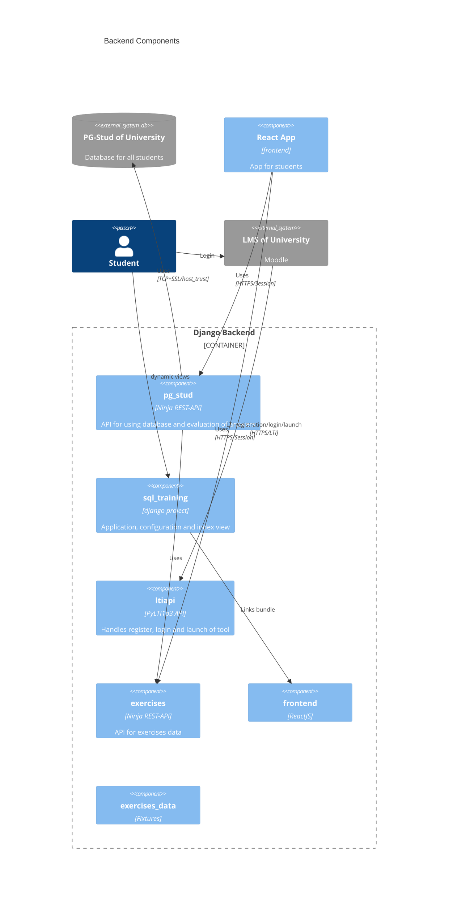
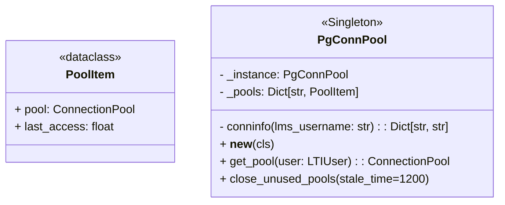
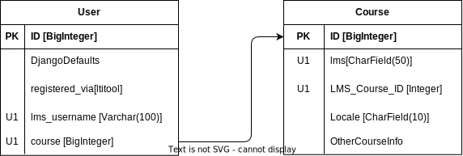

<!--
SPDX-FileCopyrightText: 2023 2023, Nicolas Bota, Marcel Geiger, Florian Paul, Rajbir Singh, Niklas Sirch, Jan Swiridow, Duc Minh Vu, Mike Wegele

SPDX-License-Identifier: CC-BY-SA-4.0

This file is based on arc42 template, originally created by Gernot Starke and Peter Hruschka, which can be found [here](https://arc42.org/download) and has been altered to fit our needs. arc42 is licensed under CC-BY-SA-4.0.
-->

# Building Block View Backend

## **Level 1**

## Motivation

The backend (except for frontend and sql_training) is structured as
semi-self-contained Django apps is to achieve a modular and scalable
architecture for the backend components of the system. This approach allows for
better code organization, reusability, and maintainability.

## Important Interfaces

| Subsystem             | Description                                      |
| --------------------- | ------------------------------------------------ |
| sql_training          | Project configuration & serving of dynamic views |
| sql_training/frontend | Linking to the frontend bundle                   |
| ltiapi                | Authentication and registration of LMSs via LTI  |
| exercises             | API for exercises                                |
| pg_stud               | API for pg-stud                                  |
| exercises_data        | Fixtures for initial data                        |

## **Level 2**

## **White Box _sql_training_**

### Modules

| File        | Responsibility                                         |
| ----------- | ------------------------------------------------------ |
| asgi.py     | The django ASGI application                            |
| settings.py | Settings of the django project                         |
| urls.py     | All urls or included urls of the project               |
| utils.py    | Utility functions for the whole project or this module |
| views.py    | View for index.html                                    |
| wsgi.py     | The django WSGI application                            |

sql_training is our django project folder.

## **White Box _Common Structure of Apps_**

| File            | Responsibility                                                                            |
| --------------- | ----------------------------------------------------------------------------------------- |
| api.py          | Contains the API views using the Ninja Django REST-Framework.                             |
| apps.py         | Defines config for app                                                                    |
| models.py       | Defines the data models using Django's ORM to interact with the database.                 |
| views.py        | Defines the views that handle user requests and control the application flow.             |
| urls.py         | Maps URLs to appropriate views and defines the routing configuration.                     |
| admin.py        | Registers models to be managed in Django's admin interface.                               |
| tests.py        | Includes unit tests to ensure the functionality and correctness of the app.               |
| schemas.py      | Contains schemas used for data validation and serialization in API request and responses. |
| translations.py | Manages i18n for models using the django-modeltranslations package.                       |
| utils.py        | Utility module                                                                            |
| fixtures/       | Defines fixtures for tests.                                                               |
| migrations/     | Auto generated database migrations that can be edited if somethings breaks.               |

### **More Details**

### `api.py`

The api.py file is responsible for handling API views within the Django app. It
defines the endpoints and handles HTTP requests. The file follows a structured
approach where the router variable is initialized as a ninja.Router instance.
This router acts as a central hub for linking different APIs together.

To merge multiple APIs within the same api.py file, routers for each API are
added to the main router instance. This ensures that all the endpoints from
different APIs are combined and accessible from a single entry point.

For each endpoint, a view function is defined and decorated with the appropriate
HTTP method using the router decorator. This establishes the connection between
the URL pattern and the corresponding view function for handling requests. The
router takes care of mapping URLs to the appropriate functions, making it easier
to define and manage the API endpoints.

### `apps.py`

The apps.py file just defines the name of the app and the default AutoFields for
the models.

### `models.py`

In this file, the data models for the Django app are defined using Django's
Object-Relational Mapping (ORM). The models represent the entities and their
relationships in the application's data structure. They define fields,
constraints, and behaviors for interacting with the underlying database.

### `views.py`

The views.py file defines the views responsible for handling user requests. It
contains functions or classes that process requests, retrieve data from the
models, apply business logic and render the appropriate templates.

### `urls.py`

This file maps the URLs of the Django app to the corresponding views. It defines
the routing configuration by associating URLs with specific views or viewsets.
It enables the app to respond to different URLs and directs the requests to the
appropriate view functions or class methods.

### `admin.py`

The admin.py file is used for registering models to be managed in Django's
built-in administration interface. It allows authorized users to perform CRUD
operations on the registered models through the admin interface, providing an
easy-to-use backend management system.

### `tests.py`

This file contains unit tests that ensure the functionality and correctness of
the Django app. It includes test cases to verify the behavior of mostly API
endpoints, models, views and other components of the app. Testing is essential
to identify and fix bugs, validate expected behaviors, and maintain the overall
quality of the application.

### `schemas.py`

In the context of API development, the schemas.py file holds the schemas used
for data validation and serialization in API requests and responses. It defines
the structure, data types, and validation rules for incoming requests and
outgoing responses. Schemas help ensure that the data exchanged through the API
conforms to the specified format and constraints. Every Schema is a Subclass of
`ninja.Schema`/`ninja.ModelSchema`.

### `translations.py`

This file manages internationalization (i18n) for models using the
django-modeltranslations package. This is done by specifying all fields that
need to be localized in a subclass of TranslationOptions per Model.

## **White Box _exercises_**

| File            | Responsibility                                         |
| --------------- | ------------------------------------------------------ |
| models.py       | Models for exercises.                                  |
| translations.py | Registering Topic, Exercise, Solution fields for i18n. |
| api.py          | Restricted CRUD API for models.                        |
| schemas.py      | Schemas for api.py.                                    |
| filter\_\*.py   | API for filtering exercises.                           |
| stats\_\*.py    | API for statistics of UserExercises per Course.        |

## **White Box _pg_stud_**

| File            | Responsibility                               |
| --------------- | -------------------------------------------- |
| api.py          | API for student database operations          |
| evaluation.py   | Module for evaluation of queries and results |
| utils.py        | Database operation functions                 |
| pg_conn_pool.py | Module for connection per user               |

### `pg_conn_pool.py`

Module for PgConnPool Singleton.

PgConnPool is a class designed for managing a connection pool for each user.
Connection pooling is utilized because it provides a convenient approach to
maintain persistent connections to the student's database, resulting in improved
performance.

To ensure that connections are not kept open indefinitely, a background thread
is created within the \_\_new\_\_() method of the PgConnPool class. This thread
is responsible for automatically discarding connections that have been inactive
for more than 20 minutes. To achieve this, a timestamp is saved when a
connection pool is opened, allowing the thread to determine which pools should
be closed based on their last activity time. By implementing this mechanism, we
can efficiently manage the lifecycle of connections and optimize resource
utilization.

## **White Box _ltiapi_**

| File                           | Responsibility                                             |
| ------------------------------ | ---------------------------------------------------------- |
| views.py                       | Views with logic for lti function                          |
| utils.py                       | Utility function for lti and extract data from launch_data |
| management/makeconsumerlink.py | Command for manage.py to make consumer link                |

## Level 3

## White Box ltiapi.views

### `RegisterConsumerView` (Class-based view):

This view handles the registration of the application as an LTI provider via the
LTI registration flow. GET request: Renders a registration form template where
the user can control the configuration steps. POST request: Initiates the
consumer configuration process by performing the following steps: Verifies that
the registration link is unused. Retrieves the necessary data from the request
parameters, such as the OpenID configuration endpoint and registration token.
Fetches information about the consumer from the OpenID configuration endpoint.
Sends the registration data to the consumer using the consumer's registration
endpoint. Uses the registration information to register the consumer to the
application. Renders a result template indicating the success or failure of the
registration process.

### `oidc_jwks` (Function-based view):

This view serves as the JWT signature delivery endpoint for OpenID Connect.
Retrieves the JSON Web Key Set (JWKS) from the tool configuration based on the
issuer and client ID. Returns the JWKS as a JSON response.

### `oidc_login` (Function-based view):

Verifies if the requesting consumer is allowed to log in and provides the
consumer with the next redirection URL. Uses OpenID Connect for authentication
and authorization. Enables cookie check and redirects the consumer to the target
link URI.

### `lti_launch` (Function-based view):

Implements the LTI launch process. Parses and verifies the data passed by the
LTI consumer. Logs in the user and redirects them based on the requested launch
type (resource launch or data privacy launch). login_lms (Function-based view):

Renders a login template for the LMS (Learning Management System) integration.

## White Box exercises.models

 :::

:::{note}
:class: dropdown
 :::
:::

## White Box ltiapi.models

:::{note}
:class: dropdown
 :::
:::
