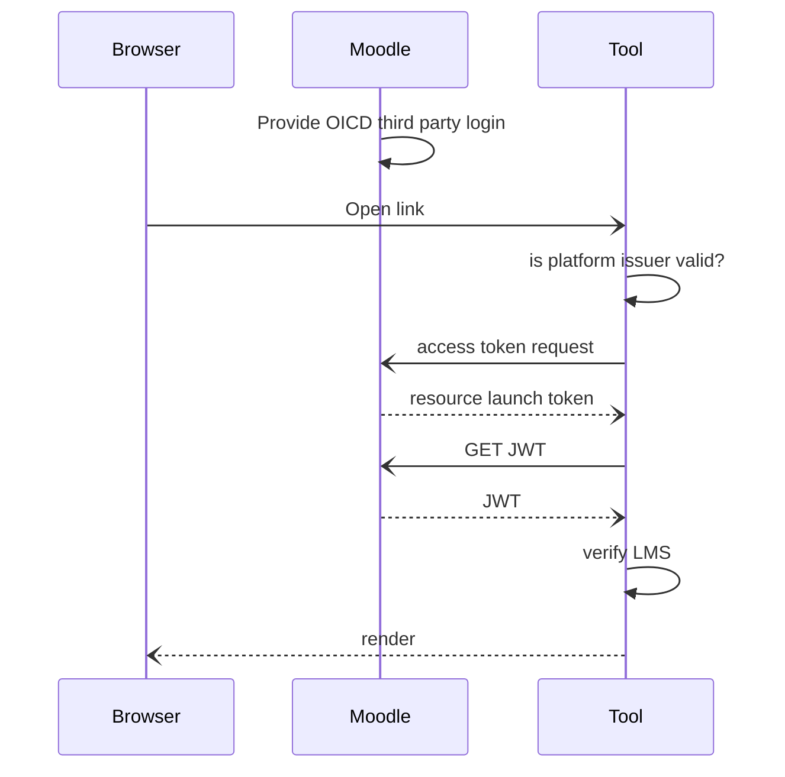
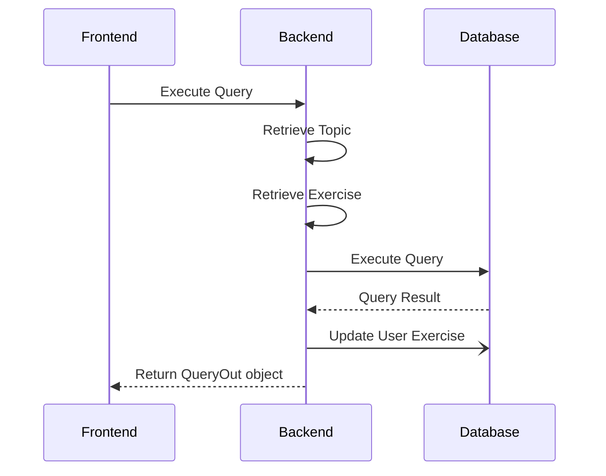
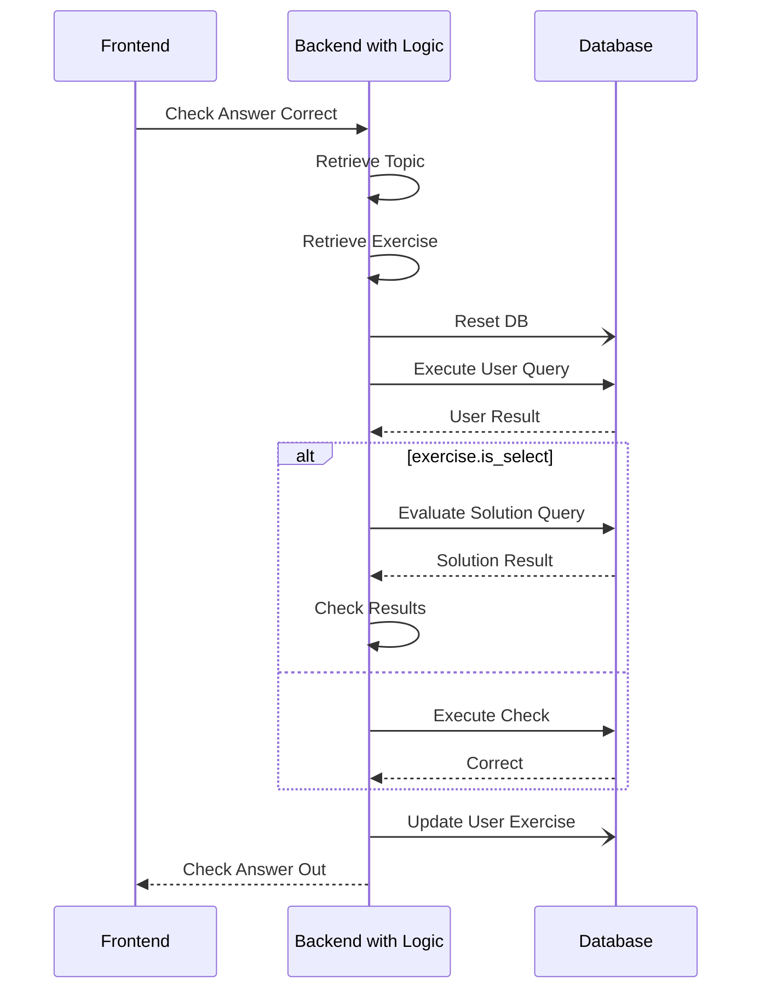
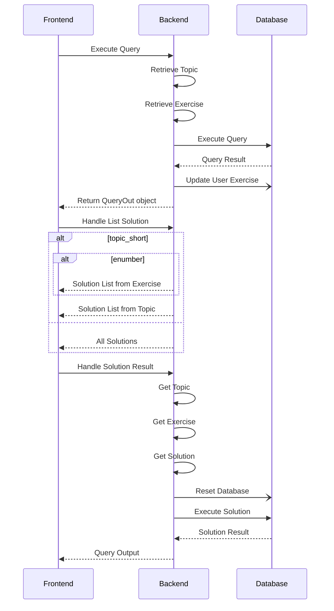
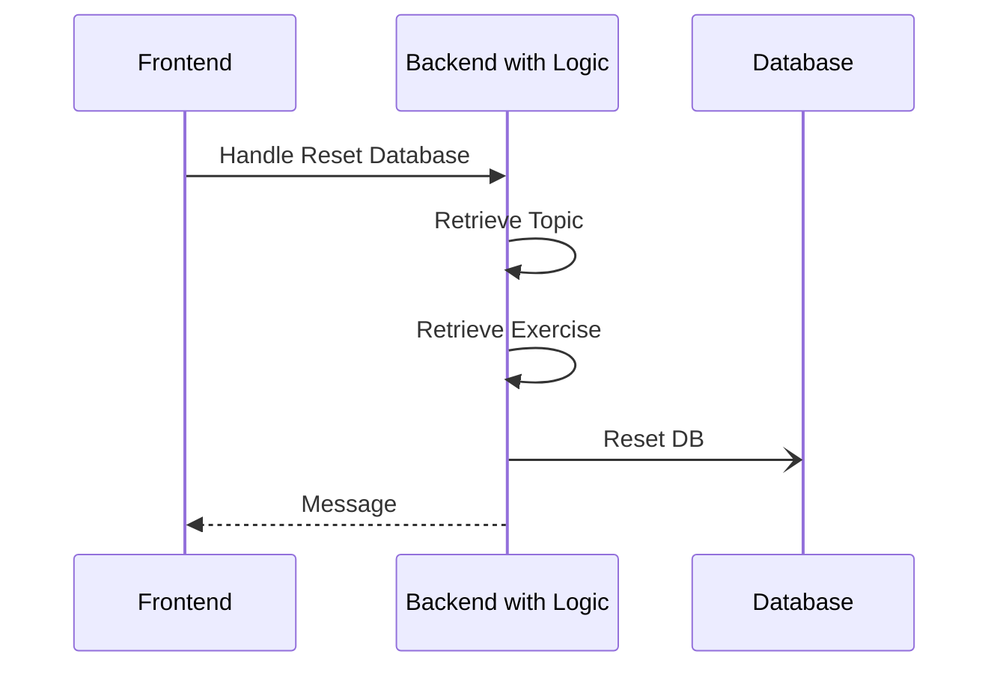

<!--
SPDX-FileCopyrightText: 2023 2023, Nicolas Bota, Marcel Geiger, Florian Paul, Rajbir Singh, Niklas Sirch, Jan Swiridow, Duc Minh Vu, Mike Wegele

SPDX-License-Identifier: CC-BY-SA-4.0

This file is based on arc42 template, originally created by Gernot Starke and Peter Hruschka, which can be found [here](https://arc42.org/download) and has been altered to fit our needs. arc42 is licensed under CC-BY-SA-4.0. 
-->

# Runtime View

## LTI Login+Launch

As one of our most important Feature is the login via LMS this sequence diagram
illustrates the process.

Sources:

- https://andyfmiller.com/2018/12/28/launching-an-lti-1-3-resource-link-using-openid-connect-third-party-login/
- https://documentation.brightspace.com/EN/integrations/ipsis/LTI%20Advantage/LTI_launch_auth.htm

## pg_stud API

This section describes the usage of the REST API with perspective of the
frontend and backend.

### Execute Query

### Check Answer

### Show Solution

### Reset Database

