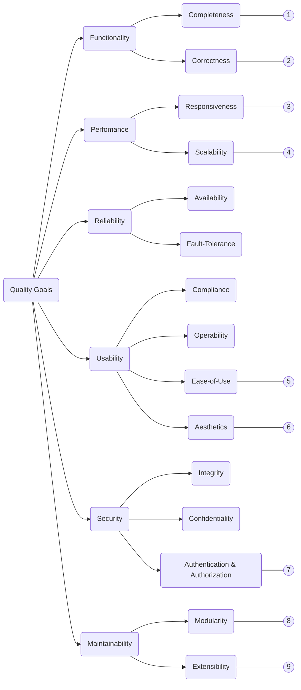

<!--
SPDX-FileCopyrightText: 2023 2023, Nicolas Bota, Marcel Geiger, Florian Paul, Rajbir Singh, Niklas Sirch, Jan Swiridow, Duc Minh Vu, Mike Wegele

SPDX-License-Identifier: CC-BY-SA-4.0

This file is based on arc42 template, originally created by Gernot Starke and Peter Hruschka, which can be found [here](https://arc42.org/download) and has been altered to fit our needs. arc42 is licensed under CC-BY-SA-4.0. 
-->

# Quality Requirements

## Quality Tree

## Quality Scenarios

| ID   | Description                                                  |
| ---- | ------------------------------------------------------------ |
| 1    | SQL-Train offers a wide variety of SQL-Statements  - select with join, subselect, ... - alter table - delete table - update table |
| 2    | Exercises and their solutions have been checked for correctness by the developers and by Users. |
| 3    | SQL-Train checks the exercise and shows the result in <1 second |
| 4    | SQL-Train can be scaled by using multiple docker containers and a load balancers. |
| 5    | - The badge on the topic-buttons gives a first impression of the difficulty of the topic  - The color of the exercise-buttons provide a good overview of exercises states (untouched/wrong/correct)  - Users can easily find the right exercises with the help of the search- / filter-options  - Users have the option to mark exercises and directly jump to marked exercises  - Users have the option to resize the panes according to their needs  - The horizontal-menu makes it possible to jump between exercises without changing the page |
| 6    | - straighforward navigation  - minimalist and sleek design, no unnecessary elements  - many features without making it confusing |
| 7    | The page is only accessible via the LMS or by a django administration user. |
| 8    | - small, self-contained components that encapsulate their own logic and UI |
| 9    | - new features / elements can be added easily without only few changes in the rest of the code |

- new Student DB
- switching away from postgres
- clearing the data from previous semesters
- introducing new production Version of SQL-Train