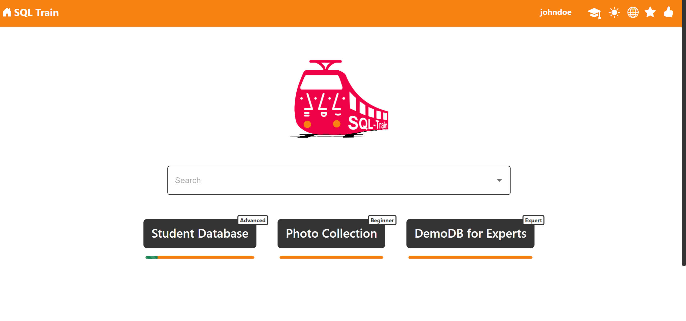
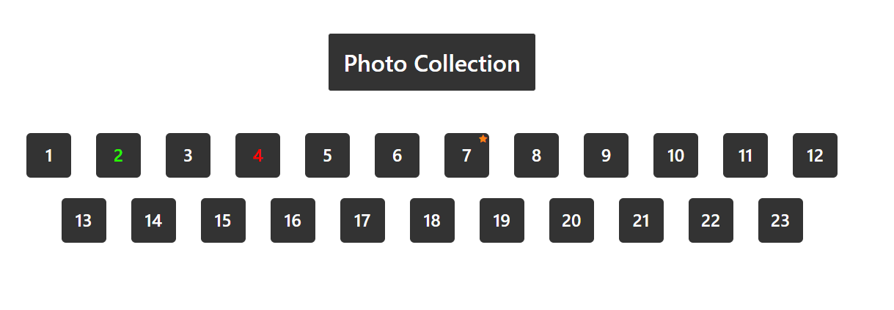
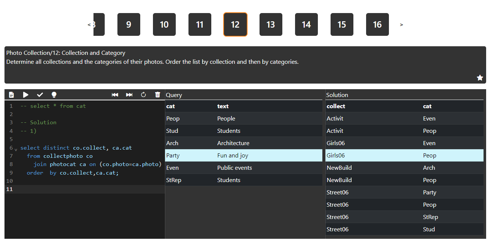

<!--
SPDX-FileCopyrightText: 2023 2023, Nicolas Bota, Marcel Geiger, Florian Paul, Rajbir Singh, Niklas Sirch, Jan Swiridow, Duc Minh Vu, Mike Wegele

SPDX-License-Identifier: CC-BY-SA-4.0
-->

# Description for Lecturers
## Structure

The frontend of SQL-Train is implemented as a web application using
TypeScript/React. It is divided roughly into the following parts:

- The homepage (topics page), which shows all available topics and offers
  filters
- The exercises page, which shows all exercises of the selected topic
- The exercise page, which shows the selected exercise

All pages have a navigation bar (username, statistics page, theme selector,
language selector, marked list, feedback, help) and a footer (imprint, privacy,
credits). The statistics page is only visible for the professors and serves as
simple dashboard.

## Selecting a topic

Before selecting an exercise the user has to choose a topic in the topics-page.
The progress bar and the difficulty badge on the topic help the user to choose a
topic. The student can also use the filter option to easily find a certain
exercises. The results are grouped by topics. This helps students to practice
specifically (e.g: JOIN exercises).

## Selecting an exercise

After selecting a topic, the user can see all exercises of the selected topic.
The exercise buttons may have three color: red for wrong, green for correct and
white for not answered. Also there can be a star in the top right corner if the
exercise is marked by the user.

## Practicing

The exercise page shows the question of the selected exercise and a input &
output box which consists of three panes. The first pane is an editor with a
toolbar and syntax-highlighting where the user types the SQL-Statements. The
second one is for showing the result table of the query and the third pane shows
the table for the correct query (solution). Some buttons of the toolbar can also
be targetted using shortcuts. The datamodel of the current topic can be
displayed under the I/O box. Between the navigation bar and the question box
there is a menu where the user can select other exercises of the same topic.
This helps the user complete all exercises without changing the page.

